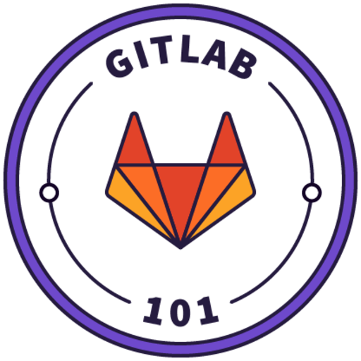

### Hi there 🎉

### I’m Marcio Coutinho -> Marhc 😎

I'm a brazilian Web Developer! 🇧🇷  
I just took the first step on my DevOps journey.  
 
And now, I'm the youngest DevOps Junior on my team! 😆  

- 🔭 I’m currently working on ...  
    - 🕸️  _Java Backend_  
          **JAX-RS (Jersey / Resteasy)** 
          **JPA (Hibernate)**  
    - 🔃  _DevOps_ 
          **Jenkins** | **Gitlab CI**  

- 🌱 I’m currently learning ...  
    - _Frontend Web_  
    **Angular** | **React**

🚀 Come on! You can reach me on...

## Technologies

### Advanced

![VBScript](https://img.shields.io/badge/VBScript-F2F4F9?style=for-the-badge&logo=data:image/png;base64,iVBORw0KGgoAAAANSUhEUgAAABkAAAAeCAYAAADZ7LXbAAABhWlDQ1BJQ0MgcHJvZmlsZQAAKJF9kT1Iw0AcxV9bRalVBzsUcchQnSyIigguWoUiVAi1QqsOJpd+QZOGJMXFUXAtOPixWHVwcdbVwVUQBD9A3NycFF2kxP8lhRYxHhz34929x907wF8vM9XsGANUzTJSibiQya4KXa8IIoIe9GFGYqY+J4pJeI6ve/j4ehfjWd7n/hy9Ss5kgE8gnmW6YRFvEE9tWjrnfeIwK0oK8TnxqEEXJH7kuuzyG+eCw36eGTbSqXniMLFQaGO5jVnRUIkniaOKqlG+P+OywnmLs1qusuY9+QtDOW1lmes0h5DAIpYgQoCMKkoow0KMVo0UEynaj3v4Bx2/SC6ZXCUwciygAhWS4wf/g9/dmvmJcTcpFAc6X2z7Yxjo2gUaNdv+PrbtxgkQeAautJa/UgemP0mvtbToEdC/DVxctzR5D7jcASJPumRIjhSg6c/ngfcz+qYsMHALBNfc3pr7OH0A0tRV8gY4OARGCpS97vHu7vbe/j3T7O8Hk2xytJuM4KoAAAAGYktHRACXAJUAjxy6pNUAAAAJcEhZcwAALiMAAC4jAXilP3YAAAAHdElNRQflChgLISznUtGhAAAAGXRFWHRDb21tZW50AENyZWF0ZWQgd2l0aCBHSU1QV4EOFwAABTZJREFUSMetlttvVFUUxn/7nDkznduZmTJtrZQOLdSWe4GScHmQ+CDFGAETabmYGAKERB+MmvjOP+AbJEZFY4KtAq2mBrykAkpAhEppuRaxRegU2pnSzkyhZ84524fSCcNMkQgr2clO9tr72+v71lp7ix07dsh0Oo2iKEgpEUIAZOZCCGzbBsj45PMbGBhgxYoVbN++nZKSElKpFJZl4ff7cViWxe7du9F1nf9rUkoOHz5MU1MT4XCYhoYGXC4XiqJgGAYOh8OBrutPBQLg8XjYuXMnvb29NDc3s3nzZjweD8lkEkVKybOyUCjEli1buH//Pm1tbSQSCTweDwrP2AKBAFu3buX69escP34cKSWOSQEftVgsxuDg4BMdWlpaCkBPTw9utxuAefPmsXfvXpxOJ458G/v7+/nkqxbivggOzTklQLSnC9fw37z3zi6qqqro6OjgwoULmfV169bR3t6O41FNotEonza1YkSWURyYlrXmcLpweXwAjN2N8c/VLiIvbeXj737lzZeXsWnTJh5mJh6Ps2fPnmy6YrEYnzW1YM5ahR4oZOROfxaIWw/i8vgwjXEunfyZytoVlFTUECyezhc/HcEYH2f58uWoqgqAEIJ0Op0tfDQaZchfgb+wiOTwEKqmZUaBT8dXWAxS0nv+dwp8OiUVNQC4vH4iq17hy6PdXL58OYfWrBSWUqK5ChCKiuYqQHO5M8OhORECLMukr/Mk1vg9bMsEJvY73V58ZVWMjI5mAWialptdtgBTmqQSw0xeQAJuPYBLgCUkC2aXU/Oci1NHD+H06tjKBD2BsQFm1TdmnWdZVjaIqqqM3B0k5JqH60FaZtYcGoYKlgSpCNbWr6FeSmzbxjRNpJR4vV5CoVAuyGTzA4hEIix2neLSjWsEyyLEr1/BtqwMJd6iUvwl0xkqrqTtyI+8sWEdXq/3sXWkaVq28F6vl40bXmNaXwcjozF8VdXo1XPQq+eiV8/FURTGUCXhhUs4Sojmgy0kk8n/LFjlUU3C4TBvvf4q4s9jJFMj3O69Qv+VTm5d6eTWxQ7u3OjBUCFcW8fPSoimA4ceC5STwpM2c+ZMttW/yOgfx/BUVBKsXUJwYS2BhbUUlJczjsW4YjNtSR0/aIU0H2whlUrlBVFVdeouvGD+fLbVzeHOmRPcS9/j9tUu+rs7uNV1llvnTzPUOxFR4dI62pxBmg/lB0qn01M3SEVRWLVyJWcv7eOcnca3cFG2gxAYAkAQXFpHy7kzKK3fsnHDejweTyaKoaGhqVv92NgYw8PDqIpCaiROajR7JO/GSCWGMRSJoQn8S5ey3xRcu3btoXtMBODIR1c8HmPf1wc4jcJg2sS4egEejtiyGDzxG5aqUrPrbdzTy0BRUEpKMAwjh5EcupLJJJ9/c5DvK2fjr5mDP0+Uic5OtIoIBYEgidgdlLLnEUJgOlXGHwGRUua+Jzdv3qTVr+OfU0Na5M1J4pe6md7QiBoMAgJTTDQf07aQaDkgOdll2zaK242cIiFQVVS/ztiNvgkKH7il43Fe6O6ivKwsh64c4cPhMItv9GIMDExRvgrh1asZvXiRsb8mRDbjcSK/tPP+2nrKy8tztuRoUlxczLvr1/NRaysdlbNRnPmfX0+4iOj+/RSvWUNVXx8frK2nuro6x8+27fxvfCQS4cONG4kODMBUX6aiabBowcR0WR0zZszI6yaEyJ/CAKWlpZlfyNNYBiSRSDBV5T+NJRIJTNNENDY2Sk3TUFU170d6cv5wBT+Jn5QSy7Jwu938C2xcMwnmSwPCAAAAAElFTkSuQmCC)

<!-- -->

### Intermediate

### Beginner 

